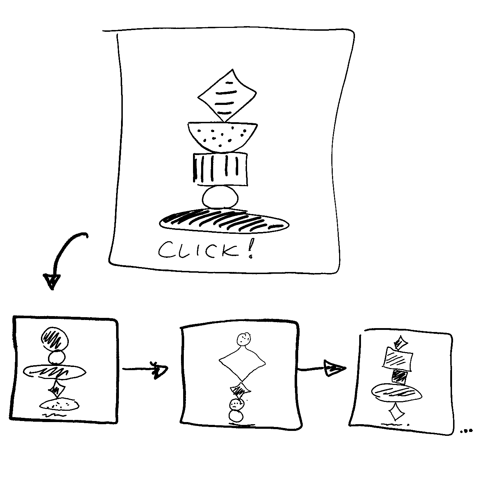
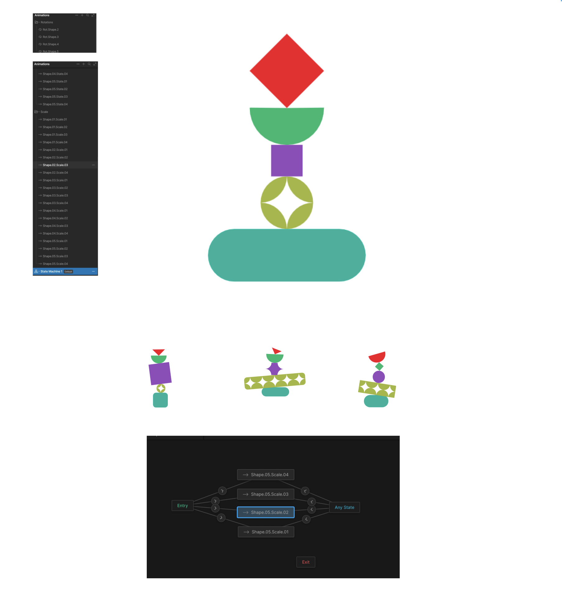

# Interactive Randomizer

Project 1: Immersive Interactive Randomizer (built in p5.js). A stack of 5 shapes leaning left and right perpetually. Click anywhere to randomize each shape's type and size.

## Wireframe

## Mood Board

## References
- [p5.js reference: sin() and cos()](https://p5js.org/reference/p5/sin/) - for the leaning animation and for tracking where each tilted shape's top edge ends up
- [p5.js reference: push(), pop(), translate(), rotate()](https://p5js.org/reference/p5/push/) - i used these for tilting each shape around its own point without impacting the shapes drawn after it
- [p5.js reference: random()](https://p5js.org/reference/p5/random/) - the shape/size randomizing on click
- [The Coding Train, "3.2: The Bouncing Ball"](https://www.youtube.com/watch?v=LO3Awjn_gyU) - the gravity + velocity idea behind bounce/landing animationn
